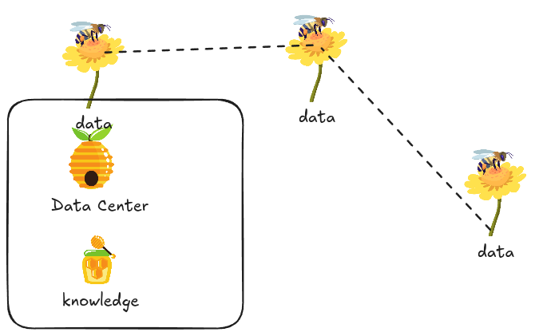
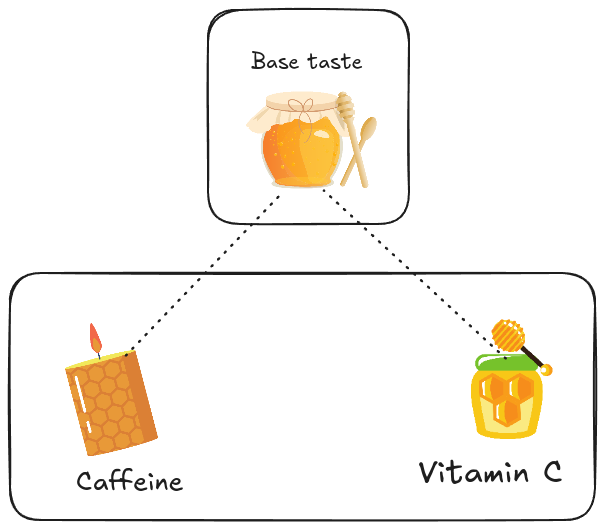
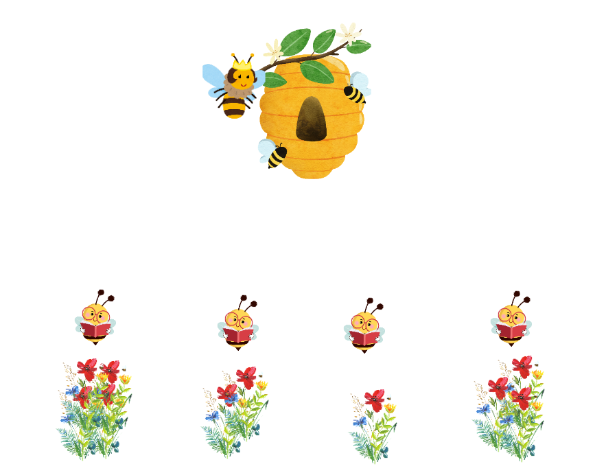
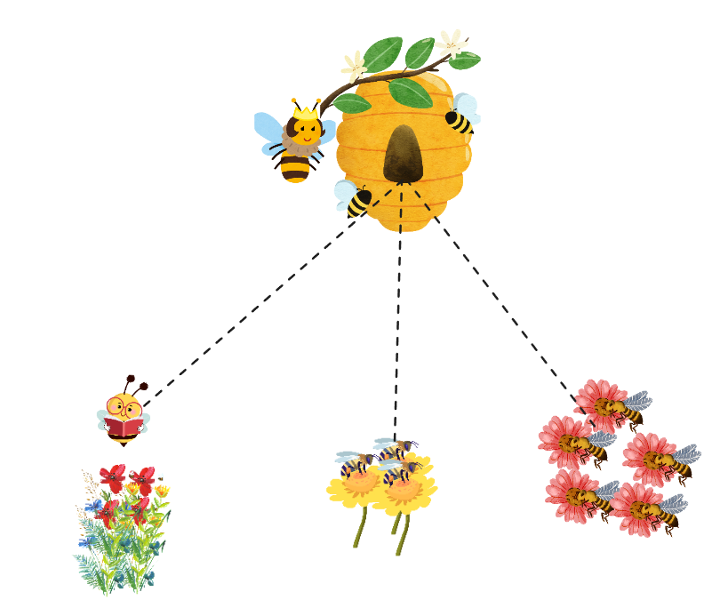
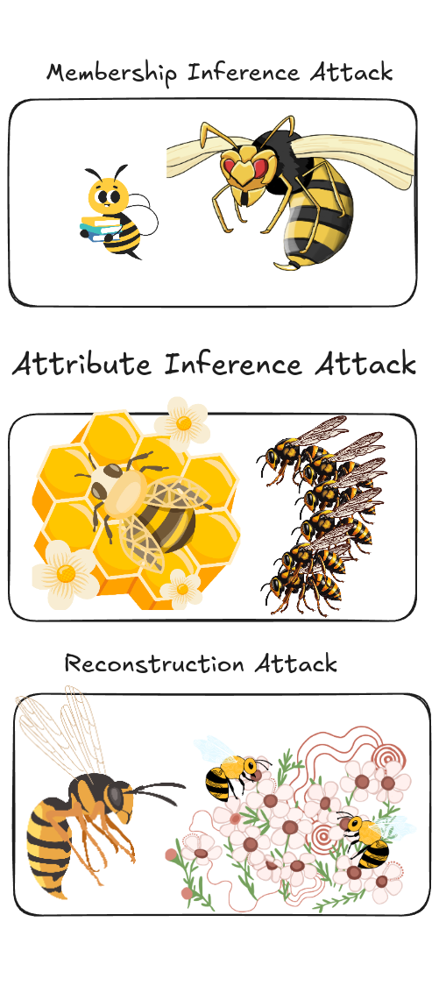

You're on a mission to create the purest, sweetest, and healthiest honey in the world. As a mad scientist, you want to improve your beehive's efficiency and ensure no one can steal your secret recipe for magic honey.  
After researching how to set up your beehive system—how the bees should communicate, and where to collect nectar in a protected way to guard against wasps that want to steal your honey and harm your beehive—you discover that a Federated Beehive could meet all your needs. However, it adds complexity to your system and requires a new mindset.

## Traditional ML Systems (Centralized)

In centralized systems, you collect flowers into your beehive and start processing them to create honey, which is not secure since people will know the type of flower on its way.

In centralized systems, we aggregate data from multiple sources into a specific center where training occurs, consuming significant bandwidth and moving user data off their devices.

## Federated Learning (Decentralized)

In FL, your bees visit different types of flowers to collect nectar and bring it back to your beehive in a fast and efficient way. The nectar is covered in a protective container to prevent the scent from attracting dark wasps and others in the world. While this approach is secure and efficient, it requires more overhead in managing bee communication globally, combining diverse nectar, and handling potential issues like poisoned nectar that could harm your entire honey supply.

## Introduction to Federated Learning

**Definition:** Federated Learning (FL) enables machine learning models on distributed data by moving the training to the data, instead of transferring data to the training center.

FL was first developed by Google in 2016 for their Gboard application, which uses a user's typing history to suggest corrections and predict upcoming words while preserving user data privacy.

The idea is as follows: distribute our model across Android users’ applications, train their data locally on their phones, and then aggregate the knowledge each user has learned using aggregation algorithms like FedAvg to combine the updates into a single global model.

This process must be repeated for multiple rounds to allow the model to learn from these small updates.

## Honey with Multiple Flavors

We decided to offer honey jars with multiple flavors based on the flower types from which nectar was collected. We’ll create a base flavor that everyone recognizes, plus special flavors with unique ingredients—some containing vitamin C, others a dose of caffeine.

In FL, this is called **personalization**. It can be seen as fine-tuning our global model (the base taste) with local data (special flowers) to meet specific needs.  
Since these unique flavors are likely to appeal only to certain local customers, they won’t be as popular with all customers compared to the base taste.

Our personalized model will excel on local data but may underperform on general data due to increased bias from fine-tuning.

An FL system allows us to manage the trade-off between user-specific preferences and generalization.

## Horizontal and Vertical FL

There are two types of FL: Horizontal (homogeneous) FL and Vertical (heterogeneous) FL.

### Horizontal Federated Learning

Imagine our bees extracting nectar from the same type of flower in different places and in various quantities.

An example of horizontal FL is the Gboard application, where local training on phones uses identical data formats with unique content reflecting the user’s typing history.

### Vertical Federated Learning

For a new honey type, we instruct our bees to collect nectar from different plants with unique characteristics, creating a distinctive honey.

## Why FL instead of Centralized Machine Learning?

1. **Centralized Learning** lacks security, making FL essential for industries like banking and healthcare.
2. **Private data** availability surpasses public data, offering more insights and patterns to uncover new abilities.
3. **User preference:** Some users expect that no data will leave their device. For example, entering passwords or credit card information should not send those details to a keyboard app’s server. This use case led to FL’s development.
4. **Regulations:** Various data privacy laws (GDPR, CCPA, etc.) protect sensitive data from being transferred. Regulations may even prohibit organizations from merging their users' data across different countries.
5. **Reduced Compute Costs:** Centralized ML with large datasets demands high computational resources, limited by individual machine performance.
6. **Faster Training:** With FL, models can train immediately after receiving data, providing users with faster, more responsive solutions.

## Are We Running Out of Training Data for GenAI?

Most LLMs are trained on publicly available web data, but there’s a need for diverse data across modalities (text, images, audio, video). LLM architectures are similar, but the data they are trained or fine-tuned on is crucial. FL can help by enabling training on:

1. Private data
   - Phones
   - Emails
2. Regulated data
   - Financial
   - Legal
3. Sensitive data
   - Doorbell camera images
   - Medical
4. Isolated data
   - Manufacturing
   - Automotive

## Wasps Attacking Your Data

Federated Learning minimizes data exposure, but gaps in federated systems still need secure solutions.

### Privacy Attacks on Federated Systems

- **Membership Inference Attack:** Identifies whether specific data samples were used in training.
- **Attribute Inference Attack:** Infers unseen attributes of training data.
- **Reconstruction Attack:** Reconstructs specific training data samples.

We’ll explore different types of FL attacks and create defenses in a future blog post.

### References

In upcoming posts, I will explain the components of Federated Learning in greater detail, including math, code, and more beekeeping analogies.

1. [Flower Framework](https://flower.ai/docs/framework/tutorial-series-what-is-federated-learning.html#Challenges-of-classical-machine-learning)
